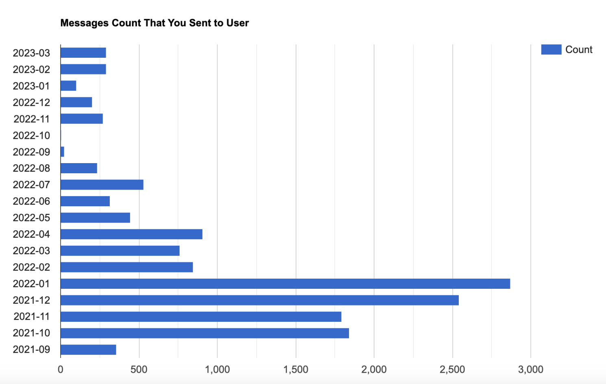

# Discord-DM-Count-Visualizer

Simple website that takes in a csv file containing your chat history with a discord user from a copy of discord personal data file (more information [here](https://support.discord.com/hc/en-us/articles/360004027692)) and displays a bar chart with the monthly total count of messages that you have sent to that user. 

https://raw.githack.com/09shir/Discord_DM_Visualizer/main/index.html

